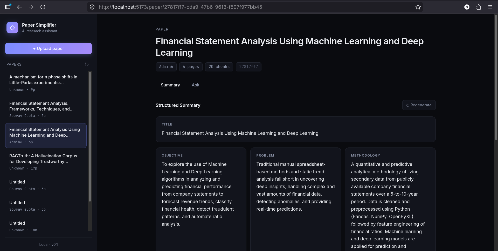
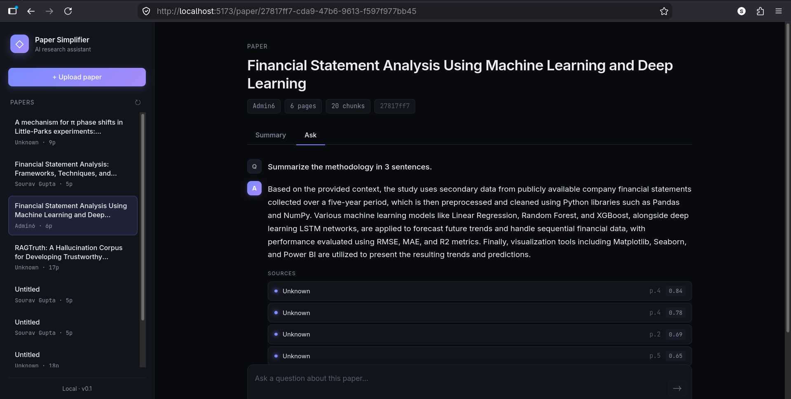
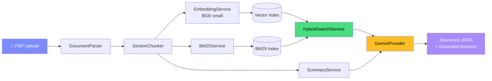

<div align="center">

# 📄 AI Research Paper Simplifier

**Upload a research paper. Get a structured summary. Ask grounded questions. Ship insights.**

[](https://python.org)
[](https://fastapi.tiangolo.com)
[](https://react.dev)
[](https://vitejs.dev)
[](https://ai.google.dev)
[](#license)

[Overview](#-overview) · [Screenshots](#-screenshots) · [Features](#-features) · [Architecture](#-architecture) · [Setup](#-quick-start) · [API](#-api-reference) · [Roadmap](#-roadmap)

</div>

---

## 🎯 Overview

**AI Research Paper Simplifier** turns dense academic PDFs into structured, digestible knowledge. Drop in a paper, and within seconds you get:

- A **structured JSON summary** — title, objective, problem, methodology, results, limitations, future work, keywords
- A **hybrid retrieval engine** that finds the exact passages relevant to your question
- **Grounded Q&A** powered by Google Gemini — every answer cites the sections it drew from
- A **sleek dark UI** built for researchers, students, and anyone tired of skimming 40-page PDFs

No more Ctrl+F. No more hallucinated answers. Every response is anchored to your document.

---

## 📸 Screenshots

### 🧠 Structured Summary

<div align="center">
  
</div>

> Every paper is distilled into a structured card layout — title, objective, problem, methodology, datasets, results, limitations, future work, and keyword pills. Regenerate on demand.

### 💬 Grounded Q&A with Citations

<div align="center">
  
</div>

> Ask anything about the paper. Each answer is generated strictly from retrieved chunks and cites its sources with section, page number, and relevance score.

---

## ✨ Features

<table>
<tr>
<td width="50%" valign="top">

### 🧩 Intelligent PDF Parsing
- **PyMuPDF**-based extraction with dual-column layout detection
- Ligature normalization (`fi` → `fi`) and letter-spacing collapse (`A B S T R A C T` → `ABSTRACT`)
- Automatic heading detection by font size and pattern
- Metadata extraction with smart fallbacks for missing titles/authors

</td>
<td width="50%" valign="top">

### 🔍 Hybrid Retrieval
- **Semantic search** via BGE-small embeddings (384-dim, cosine similarity)
- **Lexical search** via BM25Okapi with NFKD normalization
- **Fusion scoring** (80/20 weighted blend) with per-query normalization
- Section-aware boosting for queries like *"give the abstract"*

</td>
</tr>
<tr>
<td width="50%" valign="top">

### 🤖 Gemini-Powered Analysis
- Structured JSON summaries via `response_mime_type="application/json"`
- Grounded Q&A that refuses to answer outside the paper
- Exponential-backoff retry for `429` / `503` transient errors
- Configurable model selection via `.env`

</td>
<td width="50%" valign="top">

### 🎨 Production-Ready UI
- React 19 + Vite 6, zero UI library bloat
- Dark "research workspace" theme with glassy cards
- Drag-drop upload with progress bar
- Sidebar paper list, tabbed summary/ask views
- Typing indicators, source cards, suggestion chips

</td>
</tr>
</table>

---

## 🏗 Architecture



### The pipeline, step by step

| Stage | Component | What happens |
|:-----:|-----------|--------------|
| **1** | `DocumentParser` | Extracts text, detects layout, normalizes ligatures and letter-spacing, identifies headings |
| **2** | `SectionChunker` | Splits into ~180-word overlapping chunks with section labels |
| **3** | `EmbeddingService` | Encodes chunks with BGE-small (384-dim, L2-normalized) |
| **4** | `VectorService` | Persists the embedding index to disk |
| **5** | `BM25Service` | Builds a lexical index including section names |
| **6** | `SummaryService` | Prompts Gemini for structured JSON extraction |
| **7** | `HybridSearchService` | Blends semantic + lexical scores at query time |
| **8** | `GeminiProvider` | Answers questions grounded in retrieved chunks |

---

## 🛠 Tech Stack

<div align="center">

### Backend


### Frontend


</div>

---

## 🚀 Quick Start

### Prerequisites

- **Python 3.12+**
- **Node.js 20+**
- **Google Gemini API key** — get one free at [ai.google.dev](https://ai.google.dev)

### 1. Clone

```bash
git clone https://github.com/sarthakPatil96K/AI-Research-Paper-Simplifier.git
cd AI-Research-Paper-Simplifier
```

### 2. Backend setup

```bash
cd backend

# Create virtual environment
python3.12 -m venv .venv
source .venv/bin/activate         # Linux / macOS
# .venv\Scripts\activate          # Windows

# Install dependencies
pip install --upgrade pip
pip install torch --index-url https://download.pytorch.org/whl/cpu
pip install -r requirements.txt

# Configure secrets
cp .env.example .env
# Edit .env and add your GEMINI_API_KEY

# Run the API
python -m uvicorn main:app --reload --port 8000
```

Backend is now at **`http://127.0.0.1:8000`** — API docs at [`/docs`](http://127.0.0.1:8000/docs).

### 3. Frontend setup

```bash
cd ../frontend
npm install
npm run dev
```

Frontend is now at **`http://localhost:5173`**.

### 4. Configure `.env`

**`backend/.env`**
```env
GEMINI_API_KEY=your_key_here
GEMINI_MODEL=gemini-3.8-flash
GEMINI_QA_MODEL=gemini-3.5-flash-lite
HF_TOKEN=hf_xxxxxxxxxxxxxxxx      # optional, avoids HF rate limits
```

**`frontend/.env`**
```env
VITE_API_URL=http://127.0.0.1:8000
```

---

## 📡 API Reference

| Method | Endpoint | Description |
|:------:|----------|-------------|
| `POST` | `/api/upload` | Upload and process a PDF |
| `GET`  | `/api/papers` | List all uploaded papers |
| `GET`  | `/api/paper/{id}` | Get paper metadata + summary |
| `GET`  | `/api/paper/{id}/chunks` | List all chunks with section labels |
| `POST` | `/api/paper/{id}/regenerate-summary` | Re-run Gemini summary generation |
| `POST` | `/api/search` | Hybrid semantic + lexical search |
| `POST` | `/api/ask` | Grounded Q&A with source citations |

### Example: Ask a question

```bash
curl -X POST http://127.0.0.1:8000/api/ask \
  -H 'Content-Type: application/json' \
  -d '{
    "paper_id": "1c161406-6105-4178-9b22-5019db589942",
    "question": "What are the four ratio categories?",
    "top_k": 5
  }'
```

Response:

```json
{
  "paper_id": "1c161406-...",
  "question": "What are the four ratio categories?",
  "answer": "The paper describes four categories of ratio analysis: Liquidity Ratios, Solvency Ratios, Profitability Ratios, and Activity Ratios. Liquidity ratios indicate short-term financial health (e.g., current ratio, quick ratio), while solvency ratios assess long-term stability (e.g., debt-to-equity).",
  "sources": [
    {
      "chunk_id": 8,
      "section": "3.4 Ratio Analysis",
      "page_number": 3,
      "score": 1.0
    }
  ]
}
```

### Example: Upload

```bash
curl -X POST http://127.0.0.1:8000/api/upload \
  -F 'file=@paper.pdf;type=application/pdf'
```

Returns structured metadata + the full JSON summary.

---

## 📁 Project Structure

```
AI-Research-Paper-Simplifier/
├── backend/
│   ├── app/
│   │   ├── api/                 # FastAPI routers
│   │   │   ├── ask.py           # POST /api/ask
│   │   │   ├── chat.py
│   │   │   ├── papers.py        # GET /api/papers, /api/paper/{id}
│   │   │   ├── search.py        # POST /api/search
│   │   │   ├── summary.py
│   │   │   └── upload.py        # POST /api/upload
│   │   ├── core/
│   │   │   └── container.py     # Dependency injection
│   │   ├── llm/
│   │   │   ├── base.py
│   │   │   └── gemini_provider.py
│   │   └── services/
│   │       ├── bm25_service.py
│   │       ├── document_parser.py
│   │       ├── embedding_service.py
│   │       ├── hybrid_search_service.py
│   │       ├── paper_service.py
│   │       ├── section_chunker.py
│   │       ├── summary_service.py
│   │       └── vector_service.py
│   ├── uploads/                 # Raw PDFs
│   ├── storage/summaries/       # Structured JSON summaries
│   ├── vector_db/
│   │   ├── bm25/                # BM25 pickles
│   │   ├── indexes/             # Vector indexes
│   │   └── metadata/            # Sidecar metadata JSON
│   ├── main.py
│   └── requirements.txt
│
├── frontend/
│   ├── src/
│   │   ├── components/
│   │   │   ├── AskPanel.jsx
│   │   │   ├── Sidebar.jsx
│   │   │   ├── SummaryPanel.jsx
│   │   │   ├── UploadButton.jsx
│   │   │   └── UploadHero.jsx
│   │   ├── hooks/
│   │   │   └── usePapers.js
│   │   ├── layouts/
│   │   │   └── MainLayout.jsx
│   │   ├── pages/
│   │   │   ├── HomePage.jsx
│   │   │   └── PaperPage.jsx
│   │   ├── services/
│   │   │   └── api.js
│   │   ├── App.jsx
│   │   └── main.jsx
│   ├── package.json
│   └── vite.config.js
│
├── docs/
│   └── screenshots/
│       ├── summary.png
│       └── qa.png
│
└── README.md
```

---

## 🧠 How It Works

### Hybrid Retrieval — the core innovation

Most paper Q&A tools use **only** semantic similarity. That fails on entity queries like *"Gupta Redefining Accounting 2026"* where every chunk is topically similar. We solve this by fusing two independent signals:

```
final_score = 0.8 × semantic_score + 0.2 × bm25_score
```

- **Semantic** (BGE-small, 384-dim cosine) captures meaning
- **BM25** captures exact-term overlap — names, years, technical jargon
- Both are **min-max normalized per query** before blending
- A `MIN_SEMANTIC = 0.30` threshold filters off-topic chunks
- A **section boost** adds +0.15 when the query mentions a section name

### The letter-spacing trap

Academic PDFs from journal templates often extract as:

```
A B S T R A C T
D E S C R I P T I O N - T O - S E Q U E N C E
```

This breaks naive heading detection and tokenization. We normalize:
1. **NFKD decomposition** → `fi` becomes `fi`
2. **Letter-spacing collapse** → tokens with ≥60% single chars get joined
3. **Section-name indexing** → BM25 sees `"Abstract"` even if the word isn't in the body

### Structured summaries

Gemini is called with `response_mime_type="application/json"`, forcing pure JSON output. A regex fallback strips markdown fences if the model misbehaves. The result is parsed into a dict and stored as `storage/summaries/{paper_id}.json` — served directly as nested JSON by the API.

### Retry with exponential backoff

Google's API returns `503 UNAVAILABLE` under load. We retry up to 4 times with delays of 2s → 4s → 8s → 16s on `{429, 500, 502, 503, 504}`. On final failure, the paper still uploads successfully with an error field — no lost data.

---

## 🗺 Roadmap

- [x] PDF ingestion with heading detection
- [x] Hybrid semantic + lexical retrieval
- [x] Structured JSON summaries
- [x] Grounded Q&A with citations
- [x] Dark React UI
- [ ] Multi-paper search across a corpus
- [ ] Cross-encoder reranker (`bge-reranker-base`) on top-K
- [ ] PDF viewer with highlighted source chunks
- [ ] Chat history persistence
- [ ] Streaming answers (SSE)
- [ ] Export summary to Markdown / PDF
- [ ] User accounts and paper collections
- [ ] Support for arXiv URL ingestion

---

## 🤝 Contributing

Contributions are welcome! Please:

1. Fork the repo
2. Create a feature branch (`git checkout -b feature/amazing-feature`)
3. Commit your changes (`git commit -m 'Add amazing feature'`)
4. Push to the branch (`git push origin feature/amazing-feature`)
5. Open a Pull Request

See [CONTRIBUTING.md](CONTRIBUTING.md) for details.

---

## 📜 License

Distributed under the **MIT License**. See [`LICENSE`](LICENSE) for details.

---

## 🙏 Acknowledgements

- [Google Gemini](https://ai.google.dev) for the LLM backbone
- [BAAI](https://huggingface.co/BAAI) for the BGE embedding model
- [PyMuPDF](https://pymupdf.readthedocs.io) for PDF extraction
- [rank_bm25](https://github.com/dorianbrown/rank_bm25) for lexical retrieval
- [FastAPI](https://fastapi.tiangolo.com) and [React](https://react.dev) for the stack

---

<div align="center">

**Built with 🖤 by [Sarthak Patil](https://github.com/sarthakPatil96K)**

⭐ Star this repo if it helped you!

</div>